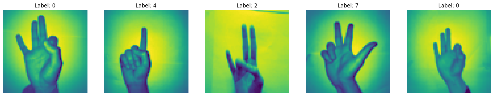
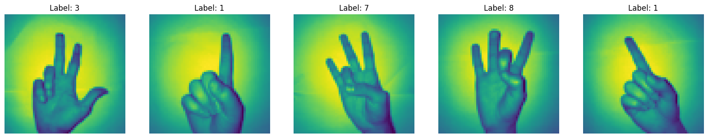
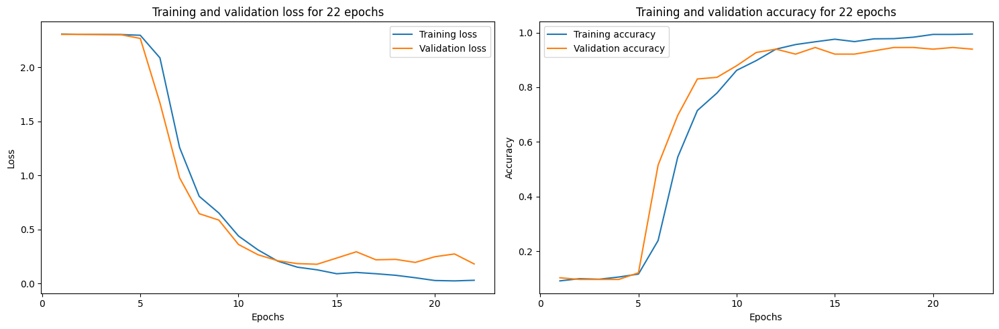
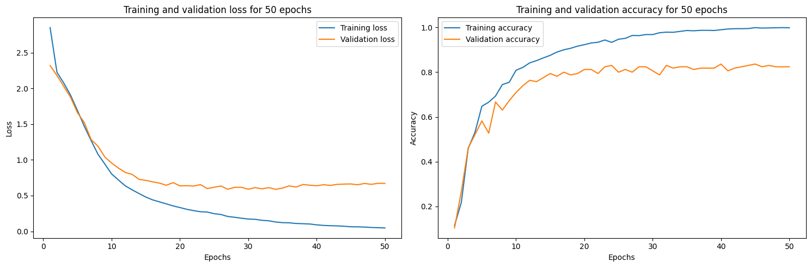
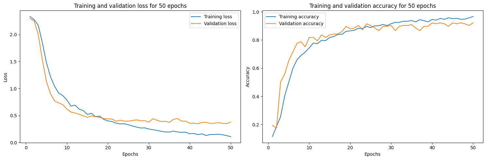
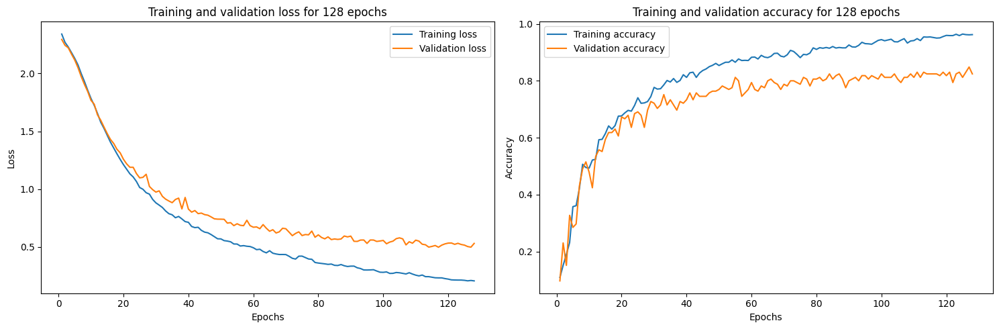
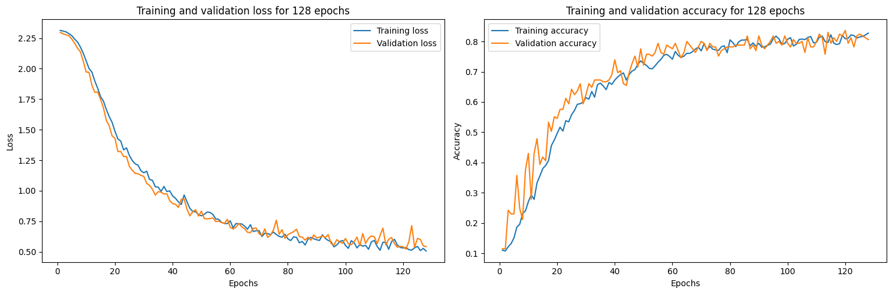
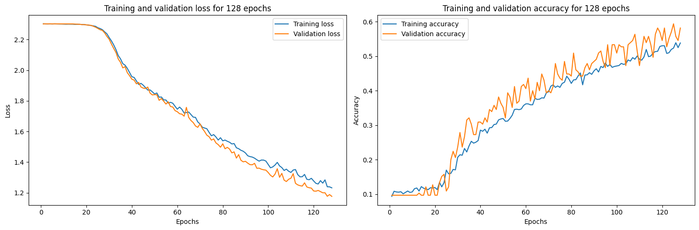
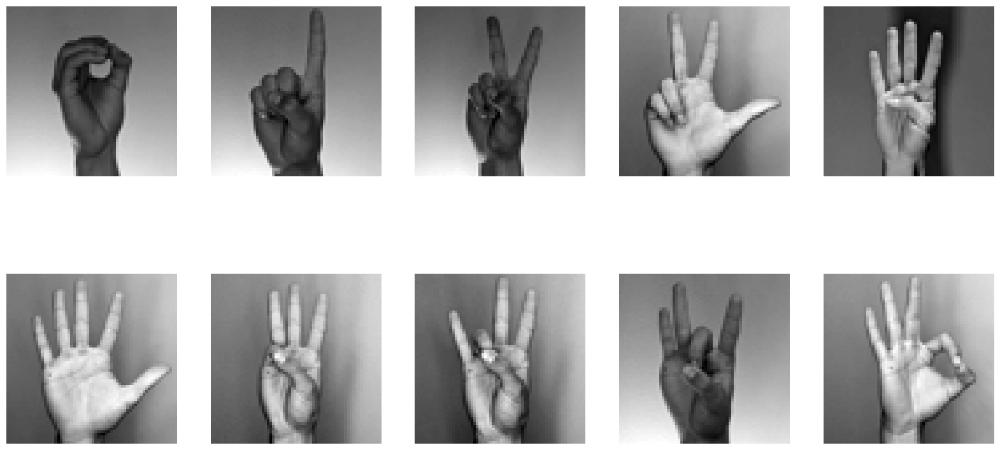

# Sign Language Digit Recognition

Classifying hand-sign photographs of the digits **0–9** with convolutional neural networks.
A compact study that compares three hand-built CNNs against three ImageNet backbones
(VGG16, ResNet50V2, ResNet152V2) on the same data and training budget, then checks the
best model on a separate set of hand photos.

<p align="left">
  
  
  
  
</p>

---

## Highlights

- **99.3% test accuracy** with a from-scratch 4-block CNN (test loss ≈ 0.057).
- **21 / 21 correct** on a separate set of hand photos, unseen during training.
- End-to-end workflow in a single notebook: label auditing → cleaning → modelling → evaluation → real-image test.
- Caught and fixed a **mislabelled target encoding** in the raw dataset (the one-hot column order does *not* match the digit values).
- Side-by-side comparison of model capacity vs. generalization, with training curves for every run.

---

## Dataset

| Property | Value |
| --- | --- |
| Samples | 2,062 |
| Image size | 64 × 64, grayscale |
| Classes | 10 (digits 0–9), ~206 images each |
| Format | `X.npy` (images), `Y.npy` (one-hot targets) |
| Duplicates | 0 |
| Source | [Sign Language Digits Dataset](https://github.com/ardamavi/Sign-Language-Digits-Dataset) (Turkey Ankara Ayrancı Anadolu High School) |

### The label bug

The provided `Y.npy` is one-hot encoded, but **the active column index is not the digit**.
Plotting random samples against `argmax(Y)` gives obviously wrong captions:



The correct mapping was recovered empirically and applied before training:

```python
label_dict = {0: 9, 1: 0, 2: 7, 3: 6, 4: 1, 5: 8, 6: 4, 7: 3, 8: 2, 9: 5}
```

After remapping and rebuilding the one-hot targets, the labels line up with the images:



---

## Approach

- **Split:** 80 / 20 train/test (`train_test_split`, `random_state=42`) → 1,649 train / 413 test, with a further 10% of the training set held out for validation.
- **Training:** Adam, categorical cross-entropy, batch size 128.
- **Custom CNNs** are trained on the grayscale `64 × 64 × 1` tensors.
- **Backbones** (VGG16 / ResNet50V2 / ResNet152V2) are instantiated with `weights=None` and a **frozen** convolutional base, then topped with `Flatten → Dense(512) → Dropout → Dense(10)`. The grayscale input is stacked to 3 channels.
- The best model (heavy CNN) is saved to `best_model.h5` and reloaded for the photo test.

| Model | Architecture | Epochs |
| --- | --- | --- |
| CNN&nbsp;·&nbsp;light | 1 conv block (32) → Dense 128 | 50 |
| CNN&nbsp;·&nbsp;medium | 2 conv blocks (32, 64) → Dense 128 + Dropout | 50 |
| CNN&nbsp;·&nbsp;heavy | 4 conv blocks (32→256) → Dense 1024/512/256 + Dropout | 22 |
| VGG16 / ResNet50V2 / ResNet152V2 | frozen base + custom head | 128 |

---

## Results

Test set (413 images).

| Model | Test accuracy | Test loss |
| --- | :---: | :---: |
| **CNN · heavy** | **99.3%** | **0.057** |
| CNN · medium | 92.7% | 0.282 |
| ResNet152V2 | 87.2% | 0.424 |
| ResNet50V2 | 86.0% | 0.449 |
| CNN · light | 85.5% | 0.521 |
| VGG16 | 59.8% | 1.126 |

### Best model — CNN · heavy

Train and validation stay close for the whole run; validation accuracy settles around 0.94 while test accuracy reaches 99.3%.



<details>
<summary><b>All training curves</b></summary>

**CNN · light** — validation accuracy plateaus near 0.82 while training accuracy climbs to 1.0 (clear overfitting).


**CNN · medium** — Dropout narrows the gap; validation accuracy ~0.90.


**ResNet152V2** — frozen randomly-initialized base; slow, steady climb, capped ~0.83 val.


**ResNet50V2** — similar behaviour to ResNet152V2.


**VGG16** — a frozen random base leaves too little trainable capacity; underfits badly.


</details>

---

## Testing on unseen photos

The saved heavy CNN is reloaded and run on a separate folder of hand photos
(`Sign Language Digits/`, filename prefix = the true digit). Each image is converted to
grayscale, resized to 64 × 64 and scaled to `[0, 1]`.

**Result: 21 / 21 correct**, loss ≈ 0.41.



---

## Repository layout

```
.
├── assets/                                  # figures used in this README (exported from the notebook)
├── src/
│   ├── sign-language-deep-learning.ipynb    # the full workflow: cleaning, models, evaluation, photo test
│   └── data/
│       ├── X.npy                            # 2062 x 64 x 64 images
│       └── Y.npy                            # 2062 x 10 one-hot targets (see "label bug")
└── README.md
```

> The "Testing on unseen photos" section reads a `Sign Language Digits/` folder of `*.jpg`
> files (and writes `best_model.h5`); neither is committed. The rest of the notebook runs
> from the included `.npy` files alone.

---

## Running it

```bash
# Python 3.9
pip install numpy pandas matplotlib scikit-learn tensorflow pillow

cd src
jupyter notebook sign-language-deep-learning.ipynb        # Run All
```

The notebook expects the data at `src/data/X.npy` and `src/data/Y.npy` (already included), so run it with `src/` as the working directory.

---

## Takeaways

- **Task-specific CNNs win here.** With only ~2k small grayscale images, a purpose-built 4-block CNN beats every ImageNet architecture by 10+ points and generalizes cleanly to new photos.
- **The backbones were not pretrained** (`weights=None`) and their bases were frozen, so they effectively train only a classifier head on top of a random feature extractor — hence the ceiling around 85–87% and VGG16's collapse to 60%.
- **Capacity alone isn't the answer:** the light CNN overfits (train ≈ 1.0, val ≈ 0.82). Adding depth *and* Dropout in the medium/heavy models is what closes the train/validation gap.

---

## Acknowledgements

- [Sign Language Digits Dataset](https://github.com/ardamavi/Sign-Language-Digits-Dataset) — Turkey Ankara Ayrancı Anadolu High School students.
- Built as coursework for a Data Analysis / Intelligent Systems course.
